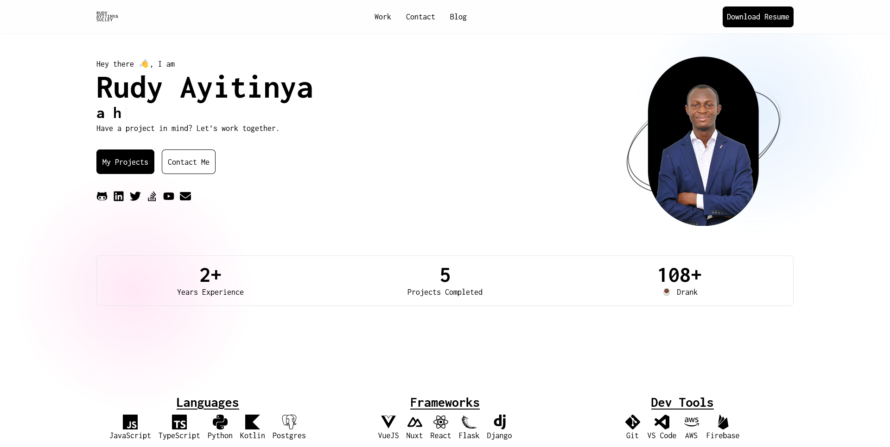

# Personal Portfolio Website

This is the source code to my personal portfolio website, [www.ayitinya.me](https://www.ayitinya.me). I actively use this to showcase the new technologies I learn in web development and also the projects I work on. Feel free to use it as a template or guide to building your own site.

## Demo


> For more screenshots, check out the [demo](demo) folder.

## Technologies Used

- This site was built using Nuxt 3
- Tailwindcss

## Installation

This site was built using Nuxt 3.
Look at the [nuxt 3 documentation](https://v3.nuxtjs.org) to learn more.

### Setup

Make sure to install the dependencies:

```bash
# yarn
yarn install

# npm
npm install

# pnpm
pnpm install --shamefully-hoist
```

### Development Server

Start the development server on <http://localhost:3000>

```bash
npm run dev
```

### Production

Build the application for production:

```bash
npm run build
```

Locally preview production build:

```bash
npm run preview
```
